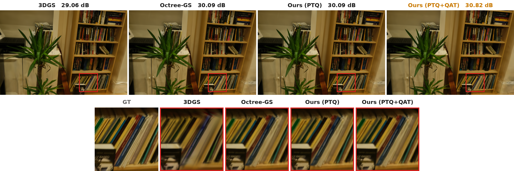

# Octree-GS: QAT + Deflate Compression (40k Baseline)

Compression pipeline on top of Octree-GS: **Lagrangian RDO → QAT fine-tuning → Deflate (NPZ)**.

---

## Environment Setup

```bash
conda env create -f environment.yml
conda activate octree-gs
pip install submodules/diff-gaussian-rasterization
pip install submodules/simple-knn
```

Key dependencies: Python 3.7.13, PyTorch 1.12.1, CUDA 11.6, pytorch-scatter.

> **Note on the convenience scripts.** `run_compress_qat_40k.sh`, `report_40k.sh`, and
> `report_compressed_40k.sh` contain a hardcoded working directory (`cd /data2/MatrixCity/...`)
> and a hardcoded interpreter path (`PY=/data3/isjang/.../bin/python`). Before running them on a
> fresh clone, edit those two lines to match your environment, or just use the equivalent
> `python ...` commands shown in each step below.

---

## Dataset

**MipNeRF-360** (7 scenes) — used for the main quantitative results:
`bicycle`, `bonsai`, `counter`, `garden`, `kitchen`, `room`, `stump`

```
data/mipnerf360/
├── bicycle/
├── bonsai/
├── counter/
├── garden/
├── kitchen/
├── room/
└── stump/
```

**BungeeNeRF** — `rome` scene (multi-scale aerial, L1–L7), used for the multi-scale rendering figure above:

```
data/bungeenerf/
└── rome/
```

---

## Usage

### 1. Baseline Training (40k iterations)

```bash
bash train_mipnerf360.sh   # launches all scenes in parallel via train.sh
```

`train_mipnerf360.sh` dispatches each scene through `train.sh` (the shared argument wrapper),
which finally calls `train.py`. To train a single scene manually:

```bash
python train.py --eval \
  -s data/mipnerf360/<scene> \
  -r -1 --gpu -1 --fork 2 --ratio 1 \
  --data_device cpu --iterations 40000 \
  -m outputs/mipnerf360/<scene>/baseline_40k_tf32off/<timestamp> \
  --appearance_dim 0 --visible_threshold -1 --base_layer 10 \
  --dist2level round --update_ratio 0.2 --progressive \
  --init_level -1 --dist_ratio 0.999 --levels -1 \
  --extra_ratio 0.25 --extra_up 0.01
```

### 2. Compression Pipeline (RDO → QAT → Render → Metrics)

Run all 7 scenes end-to-end:

```bash
bash run_compress_qat_40k.sh
```

This executes the following steps per scene:

**Step 1 — RDO: find optimal per-LOD bit allocation**

```bash
python compress_optimal.py \
  -m <model_path> -s data/mipnerf360/<scene> \
  --iteration 40000 \
  --allowed_bits 2 3 4 5 6 7 8 \
  --target_bpf 5 --max_drop 999 \
  --output_dir output_rd_40k
```

**Step 2 — QAT fine-tuning (40k → 45k)**

```bash
python train_qat.py \
  -m <model_path> -s data/mipnerf360/<scene> \
  --data_device cpu \
  --pretrained_iteration 40000 \
  --qat_iterations 5000 --lr_scale 0.1
```

Geometry parameters are frozen; `anchor_feat` is fake-quantized per-LOD with STE.

**Step 3 — Render & Metrics**

```bash
python render.py -m <model_path> --iteration 45000
python metrics.py -m <model_path>
```

Results are written to `<model_path>/results.json` under key `ours_45000`.

### 3. Report

```bash
bash report_40k.sh             # baseline metrics at iter 40000
bash report_compressed_40k.sh  # baseline vs QAT+Deflate + compression stats
```

---

## Output Structure

```
outputs/mipnerf360/<scene>/baseline_40k_tf32off/<timestamp>/
├── point_cloud/
│   ├── iteration_40000/
│   │   ├── point_cloud.ply              # float32 original
│   │   └── point_cloud_quantized.npz   # RDO bit allocation result
│   └── iteration_45000/
│       └── point_cloud.ply              # QAT fine-tuned
├── test/
│   ├── ours_40000/renders/
│   └── ours_45000/renders/
└── results.json

output_rd_40k/
├── <scene>_compress_result.json         # compression stats (bpf, size, PSNR)
└── <scene>_rd_curve.png
```

---

## Qualitative Results

Multi-scale rendering quality on the **BungeeNeRF `rome` scene** (Colosseum, L1–L7 multi-scale
aerial imagery), zoom-in / normal / zoom-out, 3DGS vs Ours:


Per-scene close-up comparison (3DGS / Octree-GS / Ours PTQ / Ours PTQ+QAT):



---

## Quantitative Results

Settings: target bpf = 5, allowed bits = {2,3,4,5,6,7,8}, QAT 5000 steps (lr_scale = 0.1)

### Storage & Compression Ratio

CR<sub>3D</sub> = size relative to 3DGS, CR<sub>O</sub> = size relative to Octree-GS.

| Scene | 3DGS (MB) | Octree-GS (MB) | Ours (MB) | CR<sub>3D</sub> (%) | CR<sub>O</sub> (%) |
|---|---|---|---|---|---|
| bicycle | 1155.5 | 227.82 | **57.04** | 4.94 | 25.04 |
| bonsai | 253.7 | 54.41 | **13.66** | 5.38 | 25.11 |
| counter | 256.7 | 66.26 | **17.00** | 6.62 | 25.66 |
| garden | 985.2 | 207.59 | **54.48** | 5.53 | 26.24 |
| kitchen | 376.8 | 55.36 | **14.23** | 3.78 | 25.70 |
| room | 310.1 | 73.94 | **19.08** | 6.15 | 25.80 |
| stump | 1030.8 | 135.70 | **35.45** | 3.44 | 26.12 |
| **Mean** | 624.26 | 117.30 | **30.13** | **4.87% (20.55×)** | **25.64% (3.90×)** |

### Rendering Quality (3DGS vs Ours)

| Scene | PSNR (3DGS) | PSNR (Ours) | SSIM (3DGS) | SSIM (Ours) | LPIPS (3DGS) | LPIPS (Ours) |
|---|---|---|---|---|---|---|
| bicycle | 25.27 | 24.98 | 0.7670 | 0.7407 | 0.2080 | 0.2495 |
| bonsai | 32.29 | 31.86 | 0.9420 | 0.9332 | 0.2030 | 0.1962 |
| counter | 29.08 | 29.61 | 0.9090 | 0.9110 | 0.1990 | 0.1924 |
| garden | 27.45 | 27.41 | 0.8680 | 0.8487 | 0.1060 | 0.1309 |
| kitchen | 31.43 | 31.29 | 0.9280 | 0.9231 | 0.1260 | 0.1290 |
| room | 31.59 | 32.54 | 0.9210 | 0.9327 | 0.2170 | 0.1816 |
| stump | 26.59 | 26.38 | 0.7700 | 0.7552 | 0.2170 | 0.2633 |
| **Mean** | 29.10 | 29.15 | 0.8721 | 0.8635 | 0.1823 | 0.1919 |

### PSNR Ablation (Octree-GS → PTQ → QAT)

| Scene | Octree-GS | PTQ | QAT |
|---|---|---|---|
| bicycle | 24.91 | 24.76 | **24.98** |
| bonsai | 31.62 | 31.25 | **31.86** |
| counter | 29.46 | 29.03 | **29.61** |
| garden | **27.46** | 27.09 | 27.41 |
| kitchen | 31.09 | 30.55 | **31.29** |
| room | 32.18 | 31.97 | **32.54** |
| stump | **26.39** | 26.18 | 26.38 |
| **Mean** | 29.02 | 28.69 | **29.15** |

---

## Key Scripts

| File | Description |
|---|---|
| `train_mipnerf360.sh` | Launch baseline training for all 7 scenes |
| `train.sh` | Argument wrapper around `train.py` (used by `train_mipnerf360.sh`) |
| `run_compress_qat_40k.sh` | Full RDO → QAT → render → metrics pipeline |
| `report_40k.sh` / `report_compressed_40k.sh` | Aggregate metric tables |
| `train.py` | Octree-GS baseline training |
| `train_qat.py` | QAT fine-tuning |
| `compress_optimal.py` | RDO / sweep-based optimal bit allocation |
| `rdo.py` | Lagrangian RDO implementation |
| `rd_sweep.py` | Brute-force RD curve generation |
| `render.py` | Test-view rendering |
| `metrics.py` | PSNR / SSIM / LPIPS evaluation |
| `make_rd_report.py` | RD curve and table visualization |
